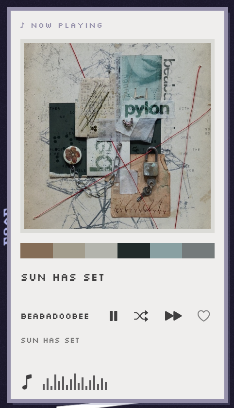
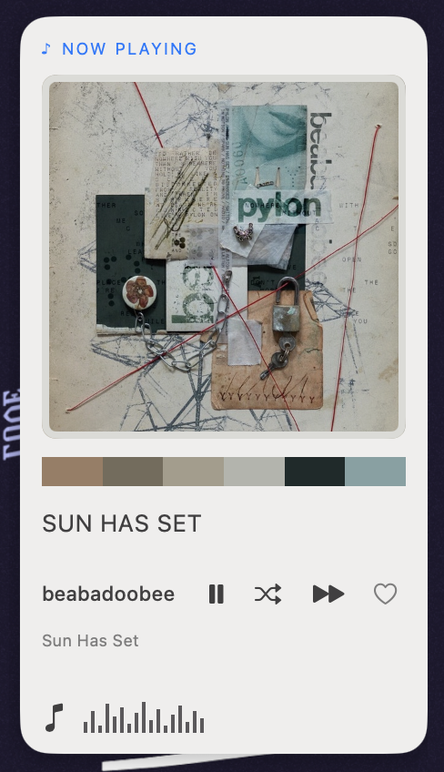
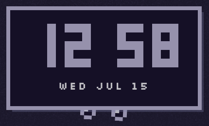
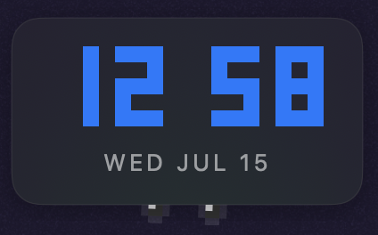

# Wixels

Wixels puts small pixel-art widgets on your macOS desktop. Clocks, system gauges,
pets, plants, weather, music, and other ambient details live behind your windows,
so your desktop can be useful without becoming another app to manage.

Wixels is a native macOS app. It has no dock icon, runs from the menu bar, and uses
the desktop layer as its canvas.

## Available extensions

The repository includes these widget packages, which can be built and installed or
selected for packaging:

- `clock` — time and date
- `stats` — CPU, memory, and battery
- `sys` — Wi-Fi and disk status
- `weather` — local conditions and temperature
- `nowplaying` — the current track with play/pause controls
- `poster` — album-art artwork for the current track
- `disk-snail` — a snail that measures disk usage
- `pet` — a cat that reacts to system activity
- `plant` — a plant you can water
- `quotes` — a clickable quote bubble
- `frog` — a temperature-reactive frog
- `owl` — an idle/awake presence indicator

The repository also includes two themes:

- `macos` uses system colors, materials, and automatic light/dark appearance.
- `cynaberii` uses a pixel-art palette, square panels, and optional live colors from
  [pywal](https://github.com/dylanaraps/pywal).

Themes are inherited, not baked into widgets. Each widget publishes what it wants to
show, and the resolved theme decides how it looks: a widget-level `theme` wins,
otherwise the global `[theme] default` applies, otherwise `macos`. The same widgets
below render pixel-art under `cynaberii` and native under `macos` without any widget
code or options changing:

| Widget | `cynaberii` | `macos` |
| --- | --- | --- |
| `nowplaying` |  |  |
| `clock` |  |  |

For example, this config renders every widget with `cynaberii` while the clock alone
opts back into the native look:

```toml
[theme]
default = "cynaberii"

[[widget]]
kind = "nowplaying"          # inherits cynaberii from [theme]

[[widget]]
kind = "clock"
theme = "macos"              # widget-level override wins
```

## Requirements

- macOS 14 or newer
- Apple silicon for the packaged app
- Swift 6.2 when building from source

## Public beta install and run

Wixels is a public beta: there are **no automatic updates**. Each GitHub release has
two matching Apple-silicon assets: `Wixels-X.Y.Z-arm64.zip` (the host app) and
`Wixels-Cynaberii-X.Y.Z-arm64.zip` (the widgets and theme). Always replace both with
assets from the same release when upgrading.

Extract the host ZIP and move `Wixels.app` to Applications. It is ad-hoc signed and
not notarized, so Gatekeeper blocks the first launch:

- **macOS 14 (Sonoma):** right-click the app, choose **Open**, and confirm.
- **macOS 15 (Sequoia) or later:** double-click once and dismiss the warning, then
  open **System Settings > Privacy & Security**, scroll to "Wixels was blocked",
  click **Open Anyway**, and confirm. The right-click **Open** shortcut no longer
  works for unnotarized apps on Sequoia.

The host intentionally contains no widgets. Extract the matching extension pack and
follow its `INSTALL.md`: copy its `plugins/` files to `~/.config/wixels/plugins/` and
`themes/` files to `~/.config/wixels/themes/`, then clear the download quarantine so
Gatekeeper does not block the dylibs when Wixels loads them:

```sh
xattr -dr com.apple.quarantine ~/.config/wixels
```

Restart Wixels afterwards. Until that restart, the menu says that no widgets are
installed; if widgets are still missing after it, the quarantine step above is the
usual cause.

To uninstall, quit Wixels, delete the app, and optionally remove
`~/.config/wixels/plugins/libWidget*.dylib`,
`~/.config/wixels/themes/libThemeCynaberii.dylib`, and `~/.config/wixels/desktop.toml`.
Please report beta feedback and bugs through [GitHub Issues](https://github.com/dwax05/wixels/issues).

If you are running from this repository, build the host and optional extensions separately:

```sh
swift build
./build-plugins.sh
WIXELS_PLUGIN_ROOT="$PWD/build/debug" ./.build/debug/wixels
```

Wixels starts in the foreground from a source build. Press `Ctrl-C` to stop it.

On first launch, Wixels creates `~/.config/wixels/desktop.toml`. The public host-only
build's default file lists the Cynaberii widget layout before the extensions are
installed; this is expected and becomes active after installing the matching pack and
restarting. The menu shows only loaded, configured widgets. The widgets are behind
your windows, so minimize or move a window aside to see them.

## The menu-bar menu

Click the `w` icon in the menu bar to:

- enable or hide individual widgets persistently;
- turn on **Edit Layout**, then drag widgets into place;
- choose **Reset Layout** to restore each widget's default position; or
- quit Wixels.

Layout changes made by dragging and menu-bar visibility toggles are saved to
`desktop.toml`.

## Customize your desktop

Edit `~/.config/wixels/desktop.toml` in any text editor. Wixels watches this file and
reloads it after you save, so you can change the layout, theme, widget options, and
palette settings without restarting.

The smallest widget entry is:

```toml
[[widget]]
kind = "clock"
```

Omit `enabled` (or set it to `true`) to mount a widget. Set `enabled = false` to
hide it while keeping its placement, theme, and options for later re-enabling.
Delete a widget entry to return it to the unconfigured state. The order of entries controls the stacking order
when widgets overlap. You can set a global theme or override it for one widget:

```toml
[theme]
default = "cynaberii"

[[widget]]
kind = "clock"
theme = "macos"
anchor = "topCenter"
offset = [0, -70]
size = [220, 120]
```

Useful placement fields are `anchor`, `offset = [x, y]`, `size = [width, height]`,
`zBoost`, and `align`. Omit a field to keep the widget's built-in default.

Widget-specific settings go in `[widget.options]`. For example:

```toml
[[widget]]
kind = "disk-snail"

  [widget.options]
  path = "/"

[[widget]]
kind = "quotes"

  [widget.options]
  path = "~/.config/wixels/quotes.json"
```

## Colors and palettes

The optional top-level `[colors]` table can point to a
[pywal](https://github.com/dylanaraps/pywal)-compatible `colors.json` file and/or
override individual palette values. This is useful both for a fully custom palette
and for making a small adjustment to a live pywal palette:

```toml
[colors]
file = "~/.cache/wal/colors.json"
background = "#102021"
foreground = "F3E9D2"
color0 = "#1A2C2D" # color1 through color15 are also supported
```

Use `background`, `foreground`, and any of `color0` through `color15`. Each color
must be exactly six hexadecimal digits, with or without a leading `#`; invalid values
are logged and ignored. Unknown `[colors]` keys are harmless.

Every color resolves separately, so a partial configuration still works:

1. Explicit `[colors]` value
2. The palette file selected by `WIXELS_COLORS`
3. `[colors].file`, or `~/.cache/wal/colors.json` when it is omitted
4. The active theme's complete default palette

`WIXELS_COLORS` replaces only the palette file choice—it never overrides explicit
TOML colors. This also means widgets using different themes use their own defaults
for any missing components. Older `[paths].colors` entries are ignored; move the
path to `[colors].file`. `WIXELS_CONFIG` selects a different layout file.

## Add your own

Wixels is designed to be extended with drop-in widgets and themes. You do not need to
change the host app to create either one.

- [Writing widgets](docs/writing-widgets.md)
- [Writing themes](docs/writing-themes.md)
- [Architecture notes](docs/architecture.md)

Third-party widgets go in `~/.config/wixels/plugins/`, and themes go in
`~/.config/wixels/themes/`. Build them with the same Swift toolchain as Wixels. They
run inside the app, so a broken extension can take down the host.

Packaged extensions are installed in `Wixels.app/Contents/Resources/plugins` and
`Wixels.app/Contents/Resources/themes`. At runtime Wixels searches those folders,
then the two user folders above. It never scans the executable directory or SwiftPM
build directories. `WIXELS_PLUGIN_ROOT` is only an explicit source-checkout staging
override.

## Build a release package

To create an Apple-silicon app and ZIP for personal sharing:

```sh
./package-app.sh 0.1.0
```

The output is written to `dist/Wixels.app` and
`dist/Wixels-0.1.0-arm64.zip`.

Build the matching public extension asset separately:

```sh
./package-extension-pack.sh 0.1.0
```

This writes `dist/Wixels-Cynaberii-0.1.0/` and
`dist/Wixels-Cynaberii-0.1.0-arm64.zip`. Release both ZIPs together. See
[`docs/release-v0.1.0.md`](docs/release-v0.1.0.md) for the release checklist and
copy-ready notes.

`swift build` builds only the host. Widget implementations live in explicit suites:
the current pixel-art `Cynaberii` suite is under `plugins/Cynaberii/`, while a future
macOS suite may live under `plugins/Macos/`. Both share WixelsKit contracts, but only
one suite can be selected for a build. `themes/Cynaberii` and `themes/Macos` are the
corresponding theme packages.

`./build-plugins.sh [debug|release]` stages no extensions unless a suite is selected:

```sh
WIXELS_WIDGET_SUITE=Cynaberii ./build-plugins.sh debug
WIXELS_BUNDLED_WIDGET_SUITE=Cynaberii ./package-app.sh 0.1.0
```

The release packager bundles no extensions by default. It never loads or packages
multiple suites together; selected widgets retain their existing kinds such as
`clock`, `stats`, and `frog`.

## Troubleshooting

If widgets do not appear, bring the desktop forward or check that their entries are
enabled in the menu-bar menu. If a configuration edit is invalid, Wixels falls back
to its default layout.

NowPlaying, Poster, and Pet read the active system media session directly. This uses
the bundled MediaRemote adapter and supports apps that publish system now-playing
metadata, such as Music, Spotify, and compatible browsers. If macOS denies the private
MediaRemote interface after an OS update, the widgets show their idle state and Wixels
logs one diagnostic to stderr.

## Privacy and beta limitations

Wixels has no telemetry. The Weather widget makes network requests: it uses your
IP-derived location through `ipinfo.io`, then contacts its configured weather
provider. NowPlaying, Poster, and Pet depend on Apple's unsupported/private
MediaRemote interface, so macOS updates can make them degrade to an idle state.
Extensions are trusted code loaded inside Wixels; install them only from sources you
trust. Intel Macs and macOS versions before 14 are unsupported by the release ZIPs.
